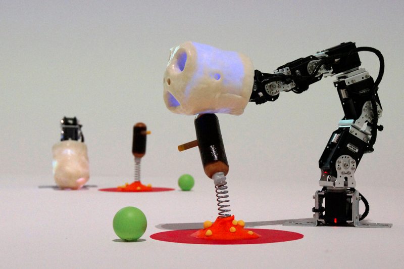

# Poppy Ergo

Poppy Ergo is a robotic 6-degree-of-freedom arm developped by the flower lab at INRIA bordeaux.

This [Poppy creature](https://github.com/poppy-project/poppy-creature) is not maintained anyway, but he have a little brother called [Poppy Ergo Jr](https://github.com/poppy-project/poppy-ergo-jr)!

This robot was developped for scientific purpose of the lab, and highlighted by ["The ergo-robots experiment, Artificial curiosity and language formation in robots"](https://flowers.inria.fr/robots/ergo-robots/) with fondation cartier.

## Description

This robot is animated by 6 Dynamixel MX-28 motors linked with 3D printable parts.

You can control this robot through USB2Dynamixel or USB2AX with the [pypot Python library](https://github.com/poppy-project/pypot) and [poppy-creature](https://github.com/poppy-project/poppy-creature).

This robot can also be simulated using V-REP.

## Install Poppy Ergo on your personnal computer
If you want to install the software locally or if you are working with the simulator, you will have to install Python. We strongly recommand using a pre-packaged distribution as [Anaconda](http://continuum.io/downloads) and install [poppy-ergo](https://github.com/poppy-project/poppy-ergo/tree/master/software) package (the easiest way is with `pip install poppy-ergo`).

**For more informations, refer to the [Poppy documentation](http://docs.poppy-project.org/en/installation/index.html)**.

## Support

You need support ?
The [Poppy forum](https://forum.poppy-project.org) is the best (and single) place to ask for help !

## Contributing

You can share your experience, new design, ideas or questions on the [Poppy project forum](https://forum.poppy-project.org/).

To contribute to this repository, you can [fork it](https://help.github.com/articles/fork-a-repo/) and propose a [pull request](https://help.github.com/articles/using-pull-requests/) *([Another useful link](https://gun.io/blog/how-to-github-fork-branch-and-pull-request/))*

## License

All the technological development work made in the Poppy project is freely available under open source licenses. Only the name usage *"Poppy"* is restricted and protected as an international trademark, please contact us if you want to use it or have more information.

|   License     |     Hardware    |   Software      |
| ------------- | :-------------: | :-------------: |
| Title  | [Creative Commons BY-SA](http://creativecommons.org/licenses/by-sa/4.0/)  |[GPL v3](http://www.gnu.org/licenses/gpl.html)  |
| Logo  |   |  |

## The Poppy project history

The Poppy project is born in 2012 in the [Flowers laboratory](https://flowers.inria.fr/) at [Inria Bordeaux Sud-Ouest](http://www.inria.fr/en/centre/bordeaux).
It was initiated during [Matthieu Lapeyre](https://github.com/matthieu-lapeyre)'s PhD Thesis surpervised by [Pierre Yves Oudeyer](http://www.pyoudeyer.com/). At the beginning, the development team was composed by [Matthieu Lapeyre](https://github.com/matthieu-lapeyre) (mechanics & design), [Pierre Rouanet](https://github.com/pierre-rouanet) (software) and [Jonathan Grizou](http://jgrizou.com/) (electronics).

This project is initially a fundamental research project financed by [ERC Grant Explorer](http://erc.europa.eu/) to explore the role of embodiement and morphology properties on cognition and especially on the learning of sensori-motor tasks.

## More on the project

- [Website](https://www.poppy-project.org)
- [Forum](https://forum.poppy-project.org)
- [Youtube](https://www.youtube.com/channel/UC3iVGSr-vMgnFlIfPBH2p7Q)
- [Twitter](https://twitter.com/poppy_project)
- [Facebook](https://www.facebook.com/poppycommunity/)
- [Flickr](https://www.flickr.com/photos/poppy-project)
- [Vimeo](https://vimeo.com/poppyproject)
- [Thingiverse](http://www.thingiverse.com/poppy_project/)
